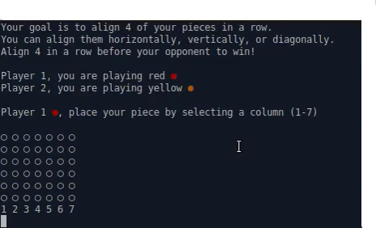
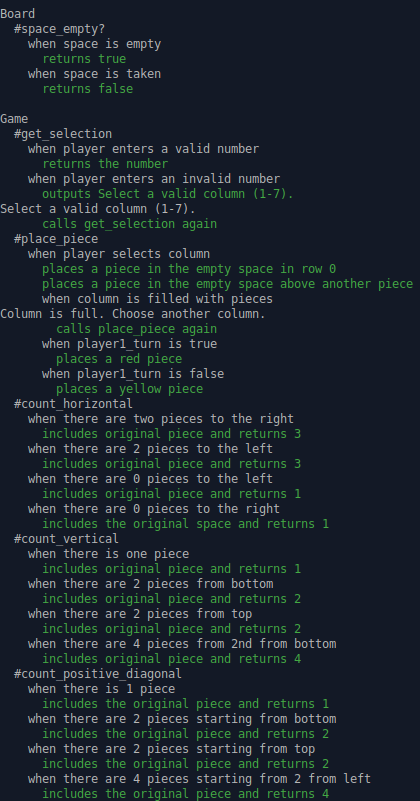
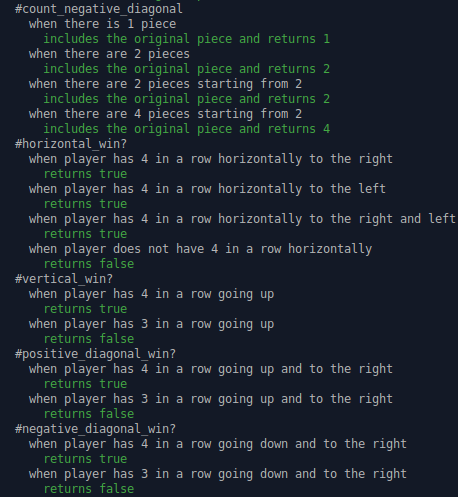
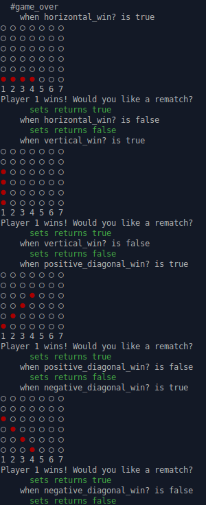
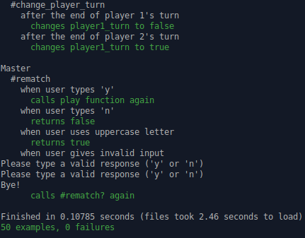

# Connect Four

This project uses the game Connect Four as a way to practice <strong>Test Driven Development (TDD)</strong> with <strong>RSpec</strong>.

This has similar functionality to all of the other Ruby CLI games I have built. The focus here is more on testing. The tests can be found below!

### Video Demo

Click here for a [LIVE DEMO](https://replit.com/@brenttbarness/Connect-Four-Ruby-CLI-Game-1?v=1)!

### 50 Passing Tests

  
  
  

